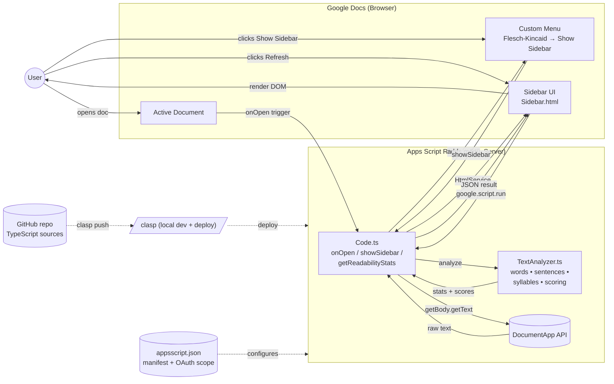

# google-docs-flesch-kincaid

A Google Docs Add-on that calculates **Flesch-Kincaid Grade Level** and **Flesch Reading Ease** scores for the active document and displays them interactively in a sidebar.


## Overview

This add-on extends Google Docs with on-demand readability analysis. When you open the sidebar and click **Refresh**, the add-on reads the active document's text, counts words / sentences / syllables, and returns two standard readability scores:

- **Grade Level** — the approximate U.S. school grade required to understand the text.
- **Reading Ease** — a 0–100 scale where higher numbers mean easier reading.

All processing happens inside the Apps Script V8 runtime. No text leaves Google's environment, and the add-on only has access to the document it is invoked from.

## Architecture

The project is a **standalone Apps Script** written in TypeScript and deployed with [`clasp`](https://github.com/google/clasp). The UI lives in a sidebar served by `HtmlService`, and the sidebar communicates with the server via `google.script.run`.



### Component breakdown

| File | Role |
| --- | --- |
| `src/Code.ts` | Server-side entry points. Implements `onInstall`, `onOpen`, `showSidebar`, and `getReadabilityStats`. Reads document text via `DocumentApp.getActiveDocument().getBody().getText()`. |
| `src/Sidebar.html` | Client-side UI (HTML + CSS + JS). Renders stats and a Refresh button; calls the server through `google.script.run`. |
| `src/TextAnalyzer.ts` | Pure helper module. Counts words, sentences, and syllables (vowel-group heuristic with silent-`e` adjustment) and computes both Flesch-Kincaid scores. |
| `src/appsscript.json` | Add-on manifest. Declares the `addOns.docs` configuration and the `documents.currentonly` OAuth scope. |
| `.clasp.json` | clasp project config — points at the Apps Script project ID. |
| `tsconfig.json` | TypeScript compiler settings targeting the Apps Script V8 runtime. |
| `conductor/plan.md` | Original implementation plan. |
| `GEMINI.md` | Developer notes and conventions. |

## Formulas

**Flesch-Kincaid Grade Level**

```
0.39 × (words / sentences)  +  11.8 × (syllables / words)  −  15.59
```

**Flesch Reading Ease**

```
206.835  −  1.015 × (words / sentences)  −  84.6 × (syllables / words)
```

Syllable counting uses a fast regex-based heuristic that counts vowel groups and subtracts one for a trailing silent `e`. Sentence counting splits on `.`, `!`, and `?`. Word counting splits on word boundaries and punctuation. The two formulas correlate inversely — text that scores high on Reading Ease will score low on Grade Level.

## Installation (developer setup)

This project deploys as a **standalone** Apps Script that publishes itself as a Docs Add-on. You'll need Node.js, npm, and a Google account.

```bash
# 1. Install clasp globally
npm install -g @google/clasp

# 2. Authenticate with your Google account
clasp login

# 3. Clone this repo
git clone https://github.com/DoIT-Artificial-Intelligence/google-docs-flesch-kincaid.git
cd google-docs-flesch-kincaid

# 4. Point .clasp.json at your own Apps Script scriptId
#    (the included scriptId belongs to the original project)

# 5. Push the TypeScript sources to Apps Script
clasp push

# 6. Open the project in the Apps Script editor
clasp open
```

From the Apps Script editor, choose **Deploy → Test deployments → Install** to attach the add-on to a Google Doc.

## Usage

1. Open a Google Doc that has the add-on installed.
2. Choose **Extensions → Flesch-Kincaid → Show Sidebar**.
3. Click **Refresh** in the sidebar to recompute scores for the current document content.

The active document's full body text is re-read every time you click Refresh, so edits show up on demand.

## OAuth scopes

The add-on requests only one scope:

- `https://www.googleapis.com/auth/documents.currentonly` — read the document the add-on is currently invoked from. The add-on has no access to other docs, Drive, or the network.

## Project layout

```
google-docs-flesch-kincaid/
├── src/
│   ├── Code.ts            # Server-side entry points
│   ├── Sidebar.html       # Sidebar UI
│   ├── TextAnalyzer.ts    # Counting + scoring
│   └── appsscript.json    # Add-on manifest
├── conductor/
│   └── plan.md            # Implementation plan
├── .clasp.json            # clasp project config
├── tsconfig.json          # TypeScript config
├── GEMINI.md              # Developer notes
├── LICENSE                # MIT
└── README.md
```

## License

[MIT](LICENSE)
