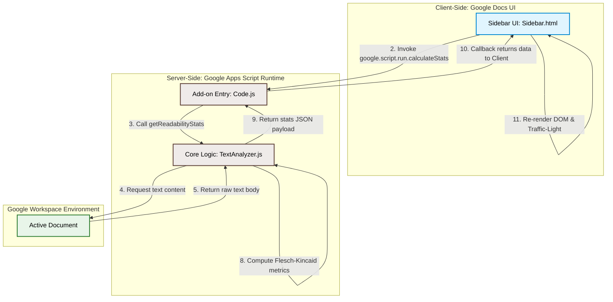

# Google Docs Flesch-Kincaid Readability Calculator

A Google Docs Add-on designed to calculate and display readability metrics (Flesch-Kincaid Grade Level and Flesch Reading Ease) along with advanced text statistics directly in a document sidebar. 


---

## Features

- **Readability Scoring:** Automatically calculates:
  - **Flesch-Kincaid Grade Level:** Indicates the US school grade level required to understand the text.
  - **Flesch Reading Ease:** A score from 0-100 indicating how easy the document is to read.
- **Traffic Light Indicators:** Visual readability status based on school grade level (Green/Good $\le$ 8.0, Orange/Fair $\le$ 10.0, Red/Difficult $>$ 10.0).
- **Text Statistics:**
  - **Counts:** Word count, character count, sentence count, paragraph count.
  - **Averages:** Sentences per paragraph, words per sentence, characters per word.
- **Passive Voice Detector:** Estimates the percentage of sentences using passive voice.
- **Google Docs Integration:** Runs inside Google Docs using a native container sidebar.

---

## Technical Architecture

The project is structured as a Google Apps Script Container Add-on. It separates client-side presentation from server-side text processing.

### Architecture Flow



### Components Description
1. **Frontend (`src/Sidebar.html`):** Renders the user interface inside the Google Docs sidebar container. It handles user interaction, executes async server-side calls, and dynamically updates the DOM and the traffic light indicator based on the returned scores.
2. **Backend Entry (`src/Code.js`):** Contains the lifecycle hooks (`onOpen` and `onInstall`) to register the Add-on menu item in Google Docs, serves the sidebar template, and exposes server-side execution wrappers for client invocation.
3. **Text Analyzer (`src/TextAnalyzer.js`):** Interacts with the `DocumentApp` service to read the active document text, runs text-processing algorithms (syllable counting, passive voice heuristic matching), and calculates the Flesch-Kincaid metrics.

---

## How It Works & Calculations

### Flesch Reading Ease Formula
$$\text{Score} = 206.835 - 1.015 \left( \frac{\text{total words}}{\text{total sentences}} \right) - 84.6 \left( \frac{\text{total syllables}}{\text{total words}} \right)$$

- **90–100:** Very Easy (5th-grade level)
- **80–90:** Easy (6th-grade level)
- **70–80:** Fairly Easy (7th-grade level)
- **60–70:** Standard (8th to 9th-grade level)
- **50–60:** Fairly Difficult (10th to 12th-grade level)
- **30–50:** Difficult (College level)
- **0–30:** Very Difficult (College graduate level)

### Flesch-Kincaid Grade Level Formula
$$\text{Grade Level} = 0.39 \left( \frac{\text{total words}}{\text{total sentences}} \right) + 11.8 \left( \frac{\text{total syllables}}{\text{total words}} \right) - 15.59$$

- Reflects the equivalent US school grade level (e.g., a score of 8.0 indicates the text is readable by an average 8th grader).

---

## Repository Structure

```
├── .clasp.json          # Clasp configuration containing the script ID
├── tsconfig.json        # TypeScript configuration for Apps Script compilation
├── src/
│   ├── Code.js          # Google Apps Script lifecycle hooks & RPC wrappers
│   ├── TextAnalyzer.js  # Text parsing, syllable counts, & readability logic
│   ├── Sidebar.html     # User interface (HTML, CSS styling, client-side JS)
│   └── appsscript.json  # Add-on configuration manifest (scopes, runtime)
```

---

## Local Development & Deployment

This project uses `clasp` (Command Line Apps Script Projects) to synchronize local files with the Google Apps Script ecosystem.

### Prerequisites

Install `clasp` globally:
```bash
npm install -g @google/clasp
```

Log in to your Google Account:
```bash
clasp login
```

### Initializing the Project

To clone the existing script project linked to this repository:
```bash
clasp clone <scriptId>
```
*(The `scriptId` can be found in `.clasp.json`).*

Or, to initialize a brand new Google Doc container script:
```bash
clasp create --title "Google Docs Flesch-Kincaid" --type docs
```

### Development Workflow

- **Pull changes from the Apps Script editor:**
  ```bash
  clasp pull
  ```
- **Push local changes to the Apps Script editor:**
  ```bash
  clasp push
  ```
- **Automatically watch and push changes during development:**
  ```bash
  clasp push --watch
  ```
- **Open the project in the online Apps Script editor:**
  ```bash
  clasp open
  ```

---

## Permissions & OAuth Scopes

The add-on declares the following scopes in `src/appsscript.json`:

- `https://www.googleapis.com/auth/documents.currentonly`: Grants access to read and edit the document the user is currently working on. Used to analyze the document's text.
- `https://www.googleapis.com/auth/script.container.ui`: Allows the script to create and show the sidebar user interface within Google Docs.