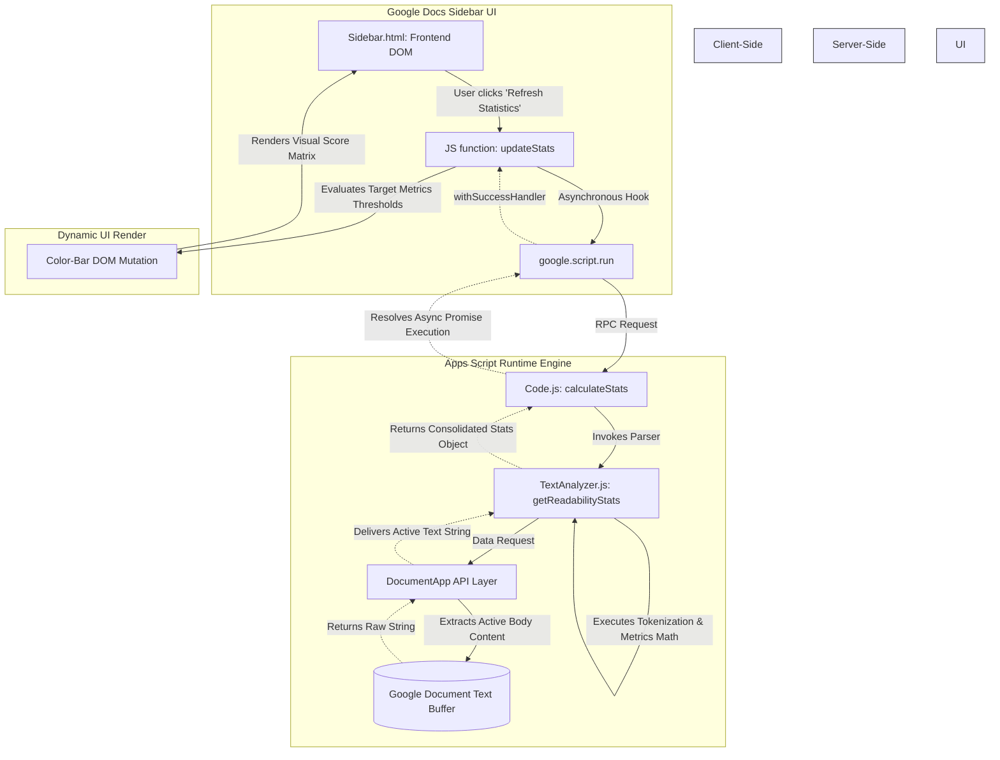

# Google Docs Flesch-Kincaid Readability Add-on

## Overview
The **Google Docs Flesch-Kincaid** project is a standalone Google Apps Script Add-on designed to calculate and display real-time text readability statistics natively inside Google Docs. It parses document contents to calculate the Flesch-Kincaid Grade Level and Flesch Reading Ease scores, giving writers immediate feedback on text clarity, structure, and style using an intuitive "Traffic Light" reporting interface inside a custom document sidebar.

---

## Features
* **Readability Scores:** Computes official Flesch-Kincaid Grade Level and Flesch Reading Ease metrics.
* **Traffic-Light Health Check:** Color-coded visual status bar based on your target audience:
    * **Good (Grade <= 8.0 Target):** Clear and accessible for general readers.
    * **Fair (Grade 8.1 - 10.0):** Slightly complex; aim lower for broad readability.
    * **Difficult / Academic (Grade > 10.0):** Complex vocabulary and sentence structures.
* **Style Diagnostics:** Monitors the percentage of passive voice sentences using standard token-based linguistic heuristics.
* **Live Document Metrics:** Provides granular breakdowns of total Word, Character, Paragraph, and Sentence counts.
* **Averages Breakdown:** Computes localized writing habits including sentences per paragraph, words per sentence, and characters per word.

---

## Technical Architecture
The add-on leverages a decoupled client-server pattern optimized for the Google Apps Script ecosystem. Client-side presentation layers running in the Google Docs interface communicate asynchronously with backend services via `google.script.run` RPC protocols.

### Architecture Interaction Flow Diagram

### Component Breakdown
1. **Frontend Presentation (`src/Sidebar.html`):** Built with HTML5/CSS3 styled using the Segoe UI/Fluent design system pattern. It triggers server commands and uses JavaScript handlers to manipulate the DOM dynamically with successful payload returns.
2. **Server Router Add-on Layer (`src/Code.js`):** Intercepts core workspace lifetime bindings (`onOpen` and `onInstall`) to append custom structural menus straight to the document taskbar UI. It works as an entry gateway forwarding execution requests to the isolated analytics framework.
3. **Core Analysis Core (`src/TextAnalyzer.js`):** Contains regex engines and logic heuristics responsible for string extraction:
    * **Sentence Breakdown:** Tokenized through standard end-of-sentence punctuation boundaries (`.`, `!`, `?`).
    * **Syllable Evaluation Heuristic:** Sub-word token parsing that tracks multi-vowel letter clusters while executing adjustments for trailing silent vowel suffix groupings.
    * **Passive Construction Tracking:** Flags syntax patterns matching variations of "to be" auxiliary phrases linked up with past-participle indicators.

---

## Readability Metrics & Formulas
The core algorithms process the extracted raw string buffer utilizing standard linguistic models:

### 1. Flesch Reading Ease
Calculates readability on a scale from 0 to 100, where higher scores signify text that is easier to read.

`Reading Ease = 206.835 - (1.015 * (Total Words / Total Sentences)) - (84.6 * (Total Syllables / Total Words))`

### 2. Flesch-Kincaid Grade Level
Translates content complexity directly into standard United States academic grade-level benchmarks.

`Grade Level = (0.39 * (Total Words / Total Sentences)) + (11.8 * (Total Syllables / Total Words)) - 15.59`

---

## Repository File Layout
* `.clasp.json` - Google Clasp workspace linking definitions
* `README.md` - Repository usage documentation
* `GEMINI.md` - AI Project contextual definitions & runtime notes
* `LICENSE` - Open-source distribution parameters (MIT)
* `tsconfig.json` - Type-checking rules configuration
* `conductor/plan.md` - Architectural blueprints and engineering strategies
* `src/appsscript.json` - Global add-on manifests and secure OAuth permissions
* `src/Code.js` - Main script routing, system events, and macro hooks
* `src/Sidebar.html` - Client UI layout, styles, and dashboard render
* `src/TextAnalyzer.js` - Heuristic text calculators and metrics formulas

---

## Local Development Setup
The repository is managed locally using Google’s Command Line Apps Script Projects tool (`clasp`).

### Prerequisites
Ensure you have Node.js installed along with the global command-line utilities:
`npm install -g @google/clasp`

### Installation and Workspace Binding
1. Authenticate your command-line environment with your Google developer profile:
   `clasp login`
2. Clone your pre-existing workspace instance directly inside the codebase:
   `clasp clone "YOUR_SCRIPT_ID_HERE"`
   *(Note: Your project-specific Script ID is tracked inside `.clasp.json`.)*

### Development Lifecycle Execution
* **Pull active changes down from the server environment:** `clasp pull`
* **Push code changes back up to the server environment:** `clasp push`
* **Stream update adjustments and watch file saves continuously:** `clasp push --watch`
* **Launch the Cloud Workspace Editor directly inside your default browser:** `clasp open`

---

## Required Authentication Scopes
The add-on operates within highly restrictive security parameters. The application manifest asks only for permissions required to read the current open document text and render UI components safely:
* `https://www.googleapis.com/auth/documents.currentonly` — Accesses text exclusively inside the active document window.
* `https://www.googleapis.com/auth/script.container.ui` — Allows sidebar windows to render correctly within Google Docs.

---

## License
This repository is distributed as open-source code protected under the parameters of the [MIT License](./LICENSE).